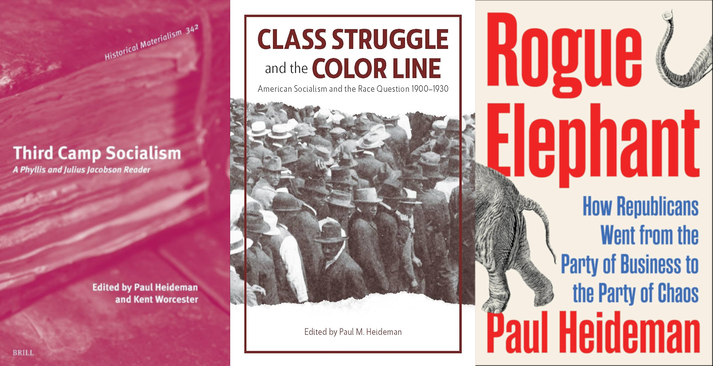

Author of the books [*Rogue Elephant: The Republicans from the Party of Business to the Party of Chaos*](https://www.versobooks.com/products/3071-rogue-elephant?srsltid=AfmBOopkwixwhTX2USNS5AEzmM2EuYpouSODgQcqpoSpuHgV9lhKyLgG), [*Third Camp Socialism: A Phyllis and Julius Jacobson Reader*](https://brill.com/display/title/71849) (with Kent Worcester), and [*Class Struggle and the Color Line: American Socialism and the Race Question, 1900-1930*](https://www.haymarketbooks.org/books/946-class-struggle-and-the-color-line). Paul Heideman is a researcher, writer, and teacher, whose work covers party politics in the United States, the history of the American left, and American intellectual history.

His writing has appeared in publications including *Jacobin*, *In These Times*, *Dissent*, *Sociology of Race and Ethnicity*, and *Catalyst*.

He can be reached at pmheideman[at]gmail.com