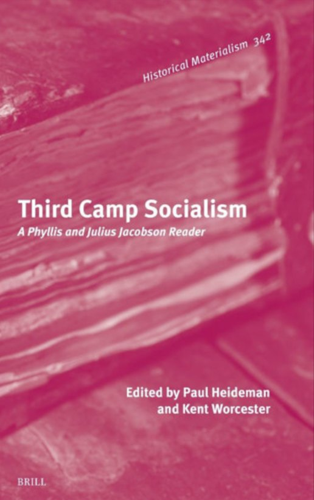
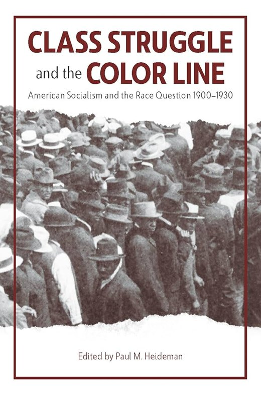
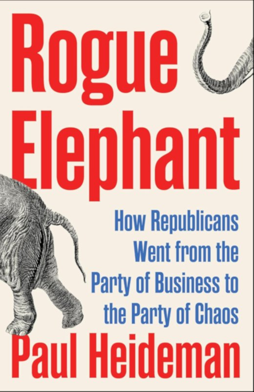

::: {.hero}
::: {.hero-text}
[Writer · Editor · Teacher]{.eyebrow .reveal}

<h1 class="hero-name">PaulHeideman</h1>

::: {.hero-lede .reveal}
Researcher, writer, and teacher whose work covers party politics in the United States, the history of the American left, and American intellectual history. Associate editor at *Jacobin* magazine.
:::

::: {.hero-actions .reveal}
[Read the writing →](writingsandmedia.html){.btn-primary-x}
[Get in touch](#contact){.btn-ghost}
:::
:::

::: {.cover-stack}
{.cover .c1}
{.cover .c2}
{.cover .c3}
:::
:::

JacobinIn These TimesDissentSociology of Race and EthnicityCatalyst
JacobinIn These TimesDissentSociology of Race and EthnicityCatalyst

::: {.band}
[Books]{.kicker .reveal}

## Three books on American politics and the left

::: {.book-grid}
::: {.book .reveal}
{.book-cover}

[Verso · 2025]{.meta}

### [Rogue Elephant](https://www.versobooks.com/products/3071-rogue-elephant)

The Republicans from the Party of Business to the Party of Chaos
:::

::: {.book .reveal}
{.book-cover}

[Brill · 2025 · with Kent Worcester]{.meta}

### [Third Camp Socialism](https://brill.com/display/title/71849)

A Phyllis and Julius Jacobson Reader
:::

::: {.book .reveal}
{.book-cover}

[Haymarket · 2018]{.meta}

### [Class Struggle and the Color Line](https://www.haymarketbooks.org/books/946-class-struggle-and-the-color-line)

American Socialism and the Race Question, 1900–1930
:::
:::
:::

::: {#contact .contact .reveal}
[Contact]{.kicker}

## Let's talk.

For interviews, talks, and editorial inquiries:

<a class="email" data-user="pmheideman" data-domain="gmail.com">pmheideman[at]gmail.com</a>
:::
